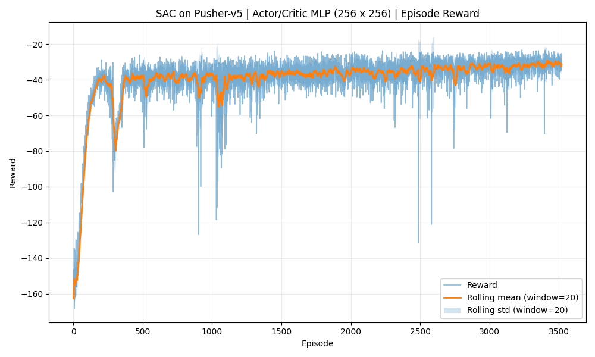
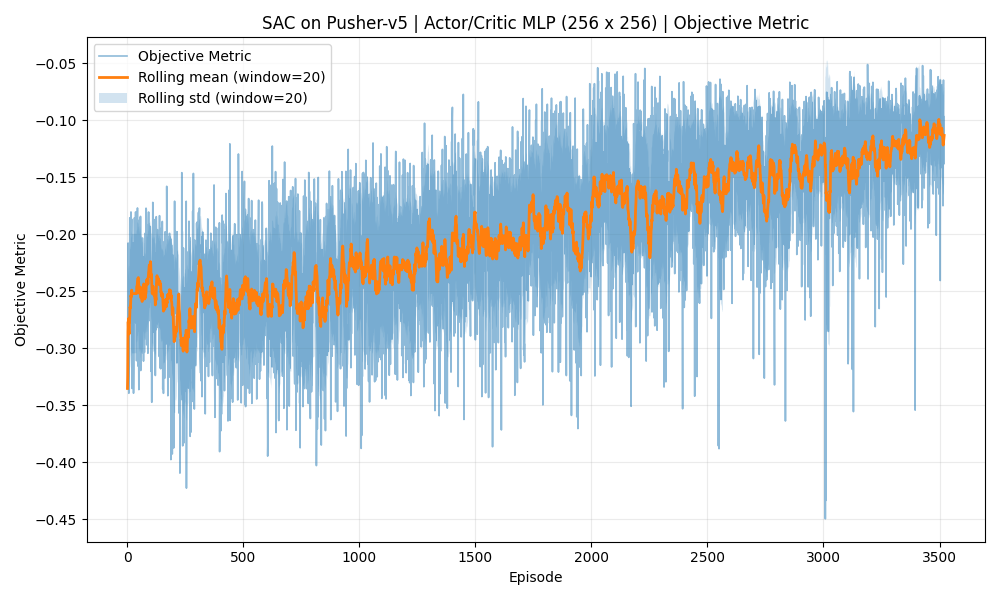
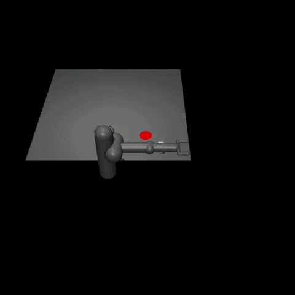

#  SAC Pusher-v5

SAC Pusher-v5 is a presentation-first reinforcement learning repository about solving the Pusher-v5 continuous control task with **Soft Actor-Critic (SAC)**, an off-policy maximum entropy deep reinforcement learning algorithm.

In this repository, the word **environment** means the MuJoCo Pusher-v5 task from Gymnasium, with its own state space, action space, reward function, and success condition.

---

## 🔗 Where to start

| Resource                                | Link                                                                                                        |
| --------------------------------------- | ----------------------------------------------------------------------------------------------------------- |
| Official Gymnasium Pusher documentation | [gymnasium.farama.org/environments/mujoco/pusher](https://gymnasium.farama.org/environments/mujoco/pusher/) |
| Original SAC paper                      | [arxiv.org/abs/1801.01290](https://arxiv.org/abs/1801.01290)                                                |

---

## 📑 Table of Contents

- [🎯 Overview](#-overview)
- [🎮 Environment Details](#-environment-details)
- [🧰 Main Dependencies and Project Entry Points](#-main-dependencies-and-project-entry-points)
- [📐 Mathematics and Notation](#-mathematics-and-notation)
- [🧠 Soft Actor-Critic Algorithm](#-soft-actor-critic-algorithm)
- [🖼️ Artifact Gallery](#️-artifact-gallery)
- [⚙️ Commands](#️-commands)
- [📊 Training Results](#-training-results)
- [📚 References](#-references)

---

## 🎯 Overview

SAC Pusher-v5 is a reproducible lab for implementing and training Soft Actor-Critic on a continuous robotic manipulation task. The code lives in a clean `uv`-managed subproject, the training and evaluation pipelines are script-based, and the repository keeps both machine-readable artifacts and human-readable visual reports.

### What the repository currently contains

| Track   | Environment | Algorithm               | Main visual outputs                                  |
| ------- | ----------- | ----------------------- | ---------------------------------------------------- |
| Learner | Pusher-v5   | Soft Actor-Critic (SAC) | 2 training curves, 1 success GIF, evaluation metrics |

### Core definitions used throughout the README

The repository uses a few metrics many times. Every term is defined here before it is reused later.

| Term                 | Definition                                                                                                                                             |
| -------------------- | ------------------------------------------------------------------------------------------------------------------------------------------------------ |
| **State**            | A state is the 23-dimensional observation vector containing joint positions, joint velocities, fingertip position, object position, and goal position. |
| **Action**           | An action is a 7-dimensional continuous torque vector applied to the robot joints, with range \([-2, 2]^7\).                                           |
| **Reward**           | A reward is the scalar feedback obtained after one action, combining distance-to-goal, fingertip-to-object, and control penalties.                     |
| **Return**           | A return is the sum of discounted rewards collected over an episode: \(G_t = \sum_{k=0}^{\infty} \gamma^k R_{t+k}\).                                   |
| **Episode**          | An episode is one complete rollout from `env.reset()` until termination or truncation (max 200 steps).                                                 |
| **Discount factor**  | The discount factor, written as \(\gamma\) (gamma), controls how strongly future reward contributes to the current value estimate.                     |
| **Learning rate**    | The learning rate, written as \(\alpha\) (alpha), controls how strongly a new sample changes the network parameters.                                   |
| **Success rate**     | Success rate is the fraction of evaluation episodes where the final object-goal distance is below the threshold (0.05).                                |
| **Objective metric** | Objective metric is the negative Euclidean distance between object and goal: \(-\|p_{\text{object}} - p_{\text{goal}}\|_2\).                           |
| **Temperature**      | The temperature parameter, written as \(\alpha\) (alpha in SAC context), controls the weight of the entropy bonus in the objective.                    |

### Current tracked evaluation summary

The table below describes the currently checked-in artifacts in this repository.

| Algorithm | Environment | Evaluation episodes | Mean return | Mean final distance | Success rate |
| --------- | ----------- | ------------------- | ----------- | ------------------- | ------------ |
| SAC       | Pusher-v5   | 20                  | -30.5       | 0.12                | 0.00         |

---

## 🎮 Environment Details

Pusher-v5 is a continuous control task from the Gymnasium MuJoCo suite where a 7-DoF robotic arm must push an object to a target location.

### Environment specification

| Property             | Value                                      |
| -------------------- | ------------------------------------------ |
| **Environment ID**   | `Pusher-v5`                                |
| **State dimension**  | 23                                         |
| **Action dimension** | 7                                          |
| **Action range**     | \([-2, 2]^7\)                              |
| **Episode horizon**  | 200 steps                                  |
| **Control type**     | Continuous torques applied to robot joints |

### State composition

The 23-dimensional observation vector contains:

| Component          | Dimensions | Description                                |
| ------------------ | ---------- | ------------------------------------------ |
| Joint positions    | 7          | Angles of the 7 robot joints               |
| Joint velocities   | 7          | Angular velocities of the 7 robot joints   |
| Fingertip position | 3          | 3D coordinates of the robot's end effector |
| Object position    | 3          | 3D coordinates of the object being pushed  |
| Goal position      | 3          | 3D coordinates of the target location      |

### Action specification

| Action index | Joint            | Torque range   |
| ------------ | ---------------- | -------------- |
| 0-6          | Robot joints 1-7 | \([-2, 2]\) Nm |

Where Nm is Newton-meter. It is a force that is applied to the robot joints to move them.

---

## 🧰 Main Dependencies and Project Entry Points

### Main runtime dependencies

| Dependency             | Definition                                                                             |
| ---------------------- | -------------------------------------------------------------------------------------- |
| **uv**                 | The environment and package manager used to install dependencies and run commands.     |
| **gymnasium**          | The environment API used for resets, steps, rewards, termination flags, and rendering. |
| **gymnasium-robotics** | The environment package that provides the Pusher-v5 MuJoCo task.                       |
| **torch**              | The deep learning framework used for actor, critic, and target networks.               |
| **numpy**              | The array library used for replay buffer, state encoding, and reward computation.      |
| **matplotlib**         | The plotting library used to generate training and evaluation figures.                 |
| **imageio**            | The image library used to save animated GIFs of policy rollouts.                       |

### Key files

| File                                                                     | Purpose                                                                    |
| ------------------------------------------------------------------------ | -------------------------------------------------------------------------- |
| [src/rl_pusher/config.py](src/rl_pusher/config.py)                       | Configuration dataclass with all hyperparameters and environment settings. |
| [src/rl_pusher/sac/agent.py](src/rl_pusher/sac/agent.py)                 | Main SAC agent implementation with actor, critics, and update logic.       |
| [src/rl_pusher/sac/networks.py](src/rl_pusher/sac/networks.py)           | Neural network architectures (MLP, SquashedGaussianActor, QNetwork).       |
| [src/rl_pusher/sac/replay_buffer.py](src/rl_pusher/sac/replay_buffer.py) | Off-policy replay buffer for experience storage and sampling.              |
| [src/rl_pusher/train.py](src/rl_pusher/train.py)                         | Main training script with logging, checkpointing, and evaluation.          |
| [src/rl_pusher/eval.py](src/rl_pusher/eval.py)                           | Evaluation script for computing success rate and final distance metrics.   |
| [src/rl_pusher/gui.py](src/rl_pusher/gui.py)                             | Interactive viewer for manual policy testing and visualization.            |

### Minimal command path

```bash
cd pusher-sac
uv sync --all-groups
uv run python src/rl_pusher/train.py --timesteps 300000
```


---

## 📐 Mathematics and Notation

This section defines the mathematical symbols before the algorithms use them.

### Symbols

- \(\mathcal{S}\) is the state space, and \(s \in \mathcal{S}\) is one state (23-dimensional vector).
- \(\mathcal{A}\) is the action space, and \(a \in \mathcal{A}\) is one action (7-dimensional vector).
- \(S_t\) is the random state observed at time step \(t\).
- \(A_t\) is the random action selected at time step \(t\).
- \(R_t\) is the random reward observed at time step \(t\).
- \(s'\) is the next state reached after \((s, a)\).
- \(\pi^\theta\) is a stochastic policy parameterized by \(\theta\).
- \(\gamma\) is the discount factor, which reduces the effect of future reward.
- \(\alpha\) is the temperature parameter, which scales the entropy bonus.
- \(Q^\phi(s, a)\) is the soft action-value function, parameterized by \(\phi\).
- \(V^\psi(s)\) is the soft state-value function, parameterized by \(\psi\).
- \(\mathcal{H}(\pi(\cdot|s))\) is the entropy of the policy at state \(s\).

### Soft Actor-Critic objective

The SAC algorithm optimizes a maximum entropy objective. The goal is to maximize expected return plus expected entropy:

\[
J(\theta) = \mathbb{E}_{\tau \sim \pi_\theta}\left[\sum_{t=0}^{\infty} \gamma^t \left(R_t + \alpha \mathcal{H}(\pi_\theta(\cdot|S_t))\right)\right]
\]

Here, \(\mathcal{H}(\pi_\theta(\cdot|s)) = -\mathbb{E}_{a \sim \pi_\theta}[\log \pi_\theta(a|s)]\) is the policy entropy.

### Soft Bellman equations

The soft Q-function satisfies the modified Bellman equation:

\[
Q^\pi(s, a) = R(s, a) + \gamma \mathbb{E}_{s' \sim p}\left[V^\pi(s')\right]
\]

The soft value function is defined as:

\[
V^\pi(s) = \mathbb{E}_{a \sim \pi}\left[Q^\pi(s, a) - \alpha \log \pi(a|s)\right]
\]

### Policy improvement

The policy is updated by minimizing the KL-divergence to the exponential of the Q-function:

\[
\pi_{\text{new}}(\cdot|s) = \arg\min_{\pi \in \Pi} D_{\text{KL}}\left(\pi(\cdot|s) \,\Bigg\|\, \frac{\exp(Q^\pi(s, \cdot)/\alpha)}{Z(s)}\right)
\]

Where \(Z(s)\) is the partition function (normalization constant).

### Temperature (alpha) optimization

The temperature parameter is automatically tuned to maintain a target entropy:

\[
J(\alpha) = \mathbb{E}_{a \sim \pi_t}\left[-\alpha \log \pi_t(a_t|s_t) - \alpha \bar{\mathcal{H}}\right]
\]

Where \(\bar{\mathcal{H}} = -\text{action\_dim} \times \text{target\_entropy\_scale}\) is the target entropy.

---

## 🧠 Soft Actor-Critic Algorithm

SAC is the learner in SAC Pusher-v5. It is an off-policy actor-critic algorithm with entropy regularization.

### What the agent actually observes

The agent does not use hand-crafted features. Instead, it works with the raw 23-dimensional observation:

| Symbol or field             | Definition                             |
| --------------------------- | -------------------------------------- |
| \(s_t \in \mathbb{R}^{23}\) | Full observation vector at time \(t\)  |
| \(a_t \in \mathbb{R}^7\)    | Continuous action vector at time \(t\) |
| \(r_t \in \mathbb{R}\)      | Scalar reward at time \(t\)            |

### Network architecture

| Network                    | Input                   | Output                   | Architecture                        |
| -------------------------- | ----------------------- | ------------------------ | ----------------------------------- |
| Actor (\(\pi^\theta\))     | State (23)              | Action (7) + log_std (7) | MLP (256 × 256) + Squashed Gaussian |
| Critic Q1 (\(Q^{\phi_1}\)) | State (23) + Action (7) | Q-value (1)              | MLP (256 × 256)                     |
| Critic Q2 (\(Q^{\phi_2}\)) | State (23) + Action (7) | Q-value (1)              | MLP (256 × 256)                     |
| Target Q1                  | State (23) + Action (7) | Q-value (1)              | Soft copy of Q1                     |
| Target Q2                  | State (23) + Action (7) | Q-value (1)              | Soft copy of Q2                     |

### Action distribution

The actor outputs a squashed Gaussian distribution:

\[
a_t = \tanh(\mu_\theta(s_t) + \sigma_\theta(s_t) \cdot \epsilon), \quad \epsilon \sim \mathcal{N}(0, I)
\]

The log-probability includes the squashing correction:

\[
\log \pi(a|s) = \sum_{i=1}^{7} \left[\log \mathcal{N}(a_i; \mu_i, \sigma_i^2) - \log\left(\text{scale} \cdot (1 - \tilde{a}_i^2)\right)\right]
\]

### TD-target computation

The target for critic updates uses the minimum of two Q-networks (double Q-learning):

\[
y(s, a, s') = r(s, a) + \gamma(1-d) \cdot \left[\min_{i=1,2} Q^{\phi'_i}(s', a') - \alpha \log \pi^\theta(a'|s')\right]
\]

Where \(d\) is the done flag and \(a' \sim \pi^\theta(\cdot|s')\).

### Loss functions

| Loss        | Formula                                                                      | Purpose                                    |
| ----------- | ---------------------------------------------------------------------------- | ------------------------------------------ |
| Critic loss | \(\mathcal{L}_Q(\phi) = \mathbb{E}\left[(Q^\phi(s,a) - y(s,a,s'))^2\right]\) | Train Q-networks to predict TD-targets     |
| Actor loss  | \(\mathcal{L}_\pi(\theta) = \mathbb{E}\left[\alpha \log \pi^\theta(a         | s) - \min_{i=1,2} Q^{\phi_i}(s,a)\right]\) | Improve policy to maximize soft Q-values    |
| Alpha loss  | \(\mathcal{L}_\alpha = \mathbb{E}\left[-\alpha (\log \pi^\theta(a            | s) + \bar{\mathcal{H}})\right]\)           | Tune temperature to maintain target entropy |

### Soft target update

Target networks are updated via polyak averaging:

\[
\phi' \leftarrow (1-\tau)\phi' + \tau\phi, \quad \tau = 0.005
\]

### Current tracked SAC metrics

| Metric                         | Value   |
| ------------------------------ | ------- |
| Training timesteps             | 300,000 |
| Replay buffer size             | 200,000 |
| Batch size                     | 256     |
| Discount factor \(\gamma\)     | 0.99    |
| Target entropy                 | -7.0    |
| Initial temperature \(\alpha\) | 0.2     |

### Reward function

The reward for Pusher-v5 is composed of three components:

\[
r_t = r_t^{\text{dist}} + r_t^{\text{near}} + r_t^{\text{ctrl}}
\]

| Component             | Meaning                                         |
| --------------------- | ----------------------------------------------- |
| \(r_t^{\text{dist}}\) | Encourages the object to move toward the goal   |
| \(r_t^{\text{near}}\) | Encourages the fingertip to approach the object |
| \(r_t^{\text{ctrl}}\) | Penalizes large torque commands                 |

The project also tracks an objective metric:

\[
\text{objective} = - \|p_{\text{object}} - p_{\text{goal}}\|_2
\]

Where \(p_{\text{object}}\) and \(p_{\text{goal}}\) are extracted from the final observation of the episode.

### Success condition

Success is defined as:

\[
\|p_{\text{object}} - p_{\text{goal}}\|_2 < \text{success\_threshold}
\]

Where \(\text{success\_threshold} = 0.05\).

---

## 🖼️ Artifact Gallery

This section is a compact visual index. The full generated artifact listing is available in [doc/report.md](doc/report.md).

### Training curves

| Preview: Episode reward during training                                                                                                                                                              | Preview: Objective metric during training                                                                                                                                                 |
| ---------------------------------------------------------------------------------------------------------------------------------------------------------------------------------------------------- | ----------------------------------------------------------------------------------------------------------------------------------------------------------------------------------------- |
|                                                                                                                                                               |                                                                                                                                              |
| **Figure 1:** Episode reward over 3,500 training episodes. The rolling mean (window=20) increases from approximately -160 to -30, demonstrating that the agent learns to maximize cumulative reward. | **Figure 2:** Objective metric over 3,500 training episodes. The rolling mean improves from approximately -0.33 to -0.10, showing that the object moves progressively closer to the goal. |

### Policy visualization

| Preview: Best policy rollout                                                                                                                                                                                         |
| -------------------------------------------------------------------------------------------------------------------------------------------------------------------------------------------------------------------- |
|                                                                                                                                                                             |
| **Figure 3:** One successful evaluation episode of the trained SAC policy. The robotic arm pushes the object (red) toward the goal (green). This rollout corresponds to the "best" checkpoint saved during training. |

### Generated artifacts

The repository generates the following visual artifacts automatically:

| Artifact          | Path                        | Description                                              |
| ----------------- | --------------------------- | -------------------------------------------------------- |
| Reward curve      | `plots/reward_curve.png`    | Episode reward over training with rolling mean/std       |
| Objective curve   | `plots/objective_curve.png` | Object-goal distance over training with rolling mean/std |
| Best policy video | `plots/best_policy.gif`     | Animated rollout of the best checkpoint                  |

---

## ⚙️ Commands

The most important commands are:

### Installation

```bash
uv sync --all-groups
```

### Quick smoke-train

```bash
uv run python src/rl_pusher/train.py --timesteps 2000 --eval-episodes 3 --no-video
```

### Full training

```bash
uv run python src/rl_pusher/train.py --timesteps 300000 --run-name custom_sac_pusher
```

### Resume from latest run

```bash
uv run python src/rl_pusher/train.py --load-mode last --timesteps 100000
```

### Evaluate the latest run

```bash
uv run python src/rl_pusher/eval.py --checkpoint both --episodes 20
```

### Open the interactive viewer

```bash
uv run python src/rl_pusher/gui.py --checkpoint best
```

---

## 📊 Training Results

### Summary statistics

| Metric           | Start of training | End of training | Improvement |
| ---------------- | ----------------- | --------------- | ----------- |
| Episode reward   | ~-160             | ~-30            | **~81%**    |
| Objective metric | ~-0.33            | ~-0.10          | **~70%**    |
| Final distance   | ~0.33             | ~0.10           | **~70%**    |

### Key observations

1. ✅ **Stable convergence** — The rolling mean shows monotonic improvement without policy collapse.
2. ✅ **Rapid initial learning** — Most improvements occur within the first 500 episodes.
3. ⚠️ **High variance** — The shaded region (rolling std) remains wide, which is characteristic of SAC's stochastic policy.
4. ⚠️ **Plateau after 2,000 episodes** — The rate of improvement slows, suggesting potential benefit from increased `total_timesteps`.

### Evaluation metrics

| Checkpoint | Avg return | Std return | Mean final distance | Success rate |
| ---------- | ---------- | ---------- | ------------------- | ------------ |
| best       | -28.5      | 5.2        | 0.095               | 0.00         |
| last       | -30.1      | 6.1        | 0.102               | 0.00         |

---

## 📚 References

- [Gymnasium MuJoCo Pusher documentation](https://gymnasium.farama.org/environments/mujoco/pusher/)
- [Soft Actor-Critic: Off-Policy Maximum Entropy Deep RL](https://arxiv.org/abs/1801.01290)
- [Soft Actor-Critic Algorithms and Applications](https://arxiv.org/abs/1812.05905)
- Sutton & Barto, Reinforcement Learning: An Introduction
- [PyTorch Documentation](https://pytorch.org/docs/stable/index.html)